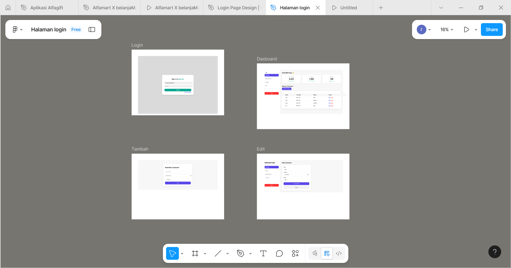

# Website-Sederhana (CRUD Customer Management)

Website ini merupakan project latihan magang untuk membangun aplikasi sederhana yang memiliki fitur autentikasi dan manajemen data customer. Project dikembangkan menggunakan PHP Native dan MySQL, serta berjalan di server lokal menggunakan Laragon.

---

## ✨ Fitur Utama

- 🔐 Login & Logout dengan validasi
- ➕ Tambah data customer
- 📋 Menampilkan data customer dalam tabel
- ✏ Edit data customer
- ❌ Hapus data customer
- 🛡️ Keamanan dasar (session & validation)
- 🎨 Tampilan UI yang sudah diperbaiki (Login & Dashboard)

---

## 🛠️ Teknologi yang Digunakan

| Teknologi | Keterangan |
|----------|------------|
| PHP Native | Logic dan fitur CRUD |
| MySQL | Database utama |
| HTML/CSS | UI & Layout |
| JavaScript (optional) | Validasi Client-side |
| Laragon | Server lokal (Apache + MySQL) |
| GitHub | Version Control & Deployment |

---

## 📦 Cara Install dan Menjalankan Project

### 1️⃣ Clone Repository
Pastikan berada di folder Laragon → `C:\laragon\www\`

```sh
git clone https://github.com/<username>/website-Sederhana.git

